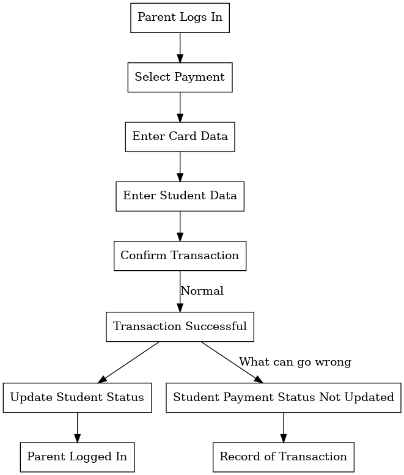

# AI-Powered SRS Workflow Generation

## Overview

This project uses language models to automate the generation of workflow graphs from Software Requirement
Specification (SRS) documents. The system analyzes textual requirements in SRS documents and outputs corresponding
workflow graphs, enabling visualization and understanding of complex software processes.

The workflow graph generation pipeline is trained and evaluated using a novel approach:

1. A strong language model, Claude Opus (claude-3-opus-20240229), generates "ground truth" workflow graphs from a
   dataset of SRS documents.
2. The generated graphs are manually verified for accuracy to create a labeled dataset.
3. A weaker language model is used in the workflow graph generation pipeline.
4. Evaluation metrics such as precision, recall, F1 score, and semantic similarity quantify the system's effectiveness
   in capturing the intended workflows from the SRS documents.

*Note: A powerful Nvidia GPU is required for this project to run efficiently.*

## Datasets

The following publicly available SRS documents are included in the pipeline:

| Code | URL                                                                                                                                                                                                                 |
|------|---------------------------------------------------------------------------------------------------------------------------------------------------------------------------------------------------------------------|
| A    | https://github.com/mahmoudai1/school-management-system/blob/main/SRS.pdf                                                                                                                                            |
| B    | https://github.com/aliasar1/Hotel-Management-System-Documentation/blob/main/Software%20Design%20Specification%20(HMS).pdf                                                                                           |
| C    | https://github.com/vrinda41198/Digital-Bus-Automation-System/blob/main/Software%20Requirements%20Specification.pdf                                                                                                  |
| E    | https://github.com/munteanuic-zz/Voting-Aggregation-System/blob/main/WaterfallProject/SRS/SRS_Team5.pdf                                                                                                             |
| F    | https://github.com/MuhammadKazim01/Software-Requirement-and-Design-Specifications-for-Bank-Management-System/blob/main/Software%20Requirement%20and%20Design%20Specification%20for%20Bank%20Management%20System.pdf |

Each file is stored in a PDF format in the `data` directory, with a filename corresponding to its code (
e.g., `A.pdf`). Processed text files are saved to `data/processed/txt` and DOT files to `data/processed/dot`. Manually
labeled files (Opus-AI-human assisted) are stored in the `data/reference-dot` directory.

The task of the LLM is to generate workflow graphs in DOT format, matching the format of the ground truth samples.

## Setup

### Hardware Requirements

- At least an Nvidia GeForce A100 GPU.

### Software Requirements

This repo assumes a debian-based distro (linux).

1. Install the Graphviz visualization software:
   ```bash
   sudo apt update
   sudo apt install graphviz -y
   ```

2. Install the miniforge package manager and follow instructions:
   ```bash
   curl -L -O "https://github.com/conda-forge/miniforge/releases/latest/download/Miniforge3-$(uname)-$(uname -m).sh"
   bash Miniforge3-$(uname)-$(uname -m).sh
   ```

3. Create the virtual environment:
   ```bash 
   mamba create -n srs-llm python=3.12 pip setuptools wheel uv -y
   ```

4. Navigate to the project root and install project dependencies:
   ```bash
   mamba run --no-capture-output --live-stream -n srs-llm \
       uv pip install -r requirements.txt
   ```

## Running the Project

To run the project, execute the following command in the terminal:

```bash
mamba run --no-capture-output --live-stream -n srs-llm \
    python main.py
```

### Example of a Generated Visual

#### SRS `A`



## License

This project is licensed under the MIT Licence.

Copyright (c) 2024-Present Marcel Coetzee