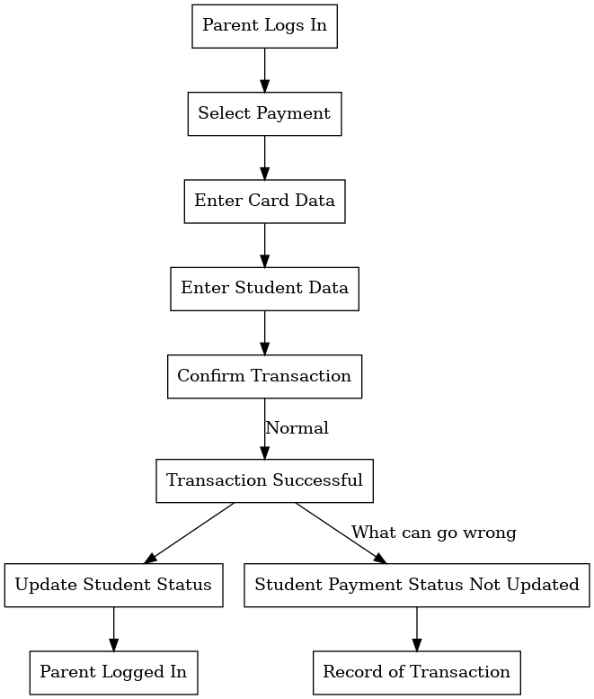
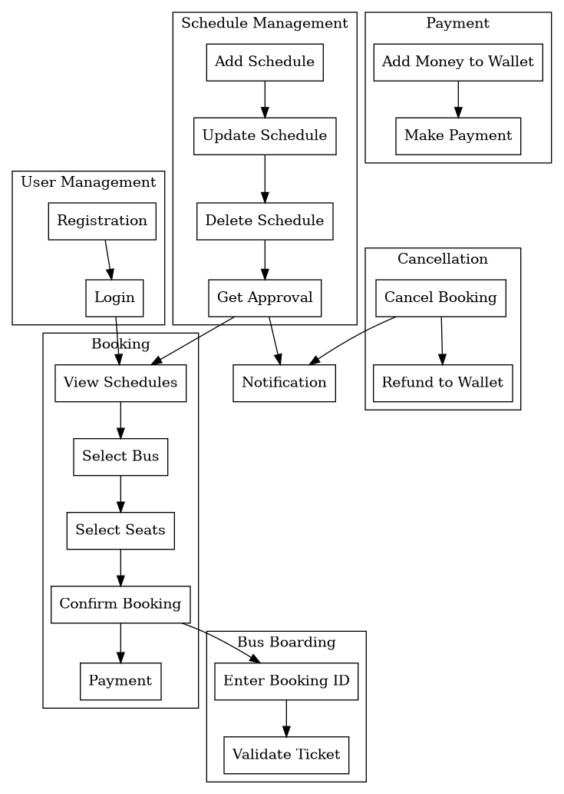
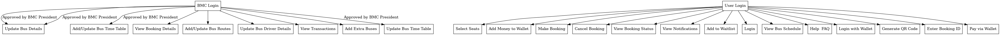

# AI-Powered SRS Workflow Generation

## Overview

This project uses language models to automate the generation of workflow graphs from Software Requirement
Specification (SRS) documents. The system analyzes textual requirements in SRS documents and outputs corresponding
workflow graphs, enabling visualization and understanding of complex software processes.

The workflow graph generation pipeline is trained and evaluated using a novel approach:

1. A strong language model, Claude Opus (claude-3-opus-20240229), generates "ground truth" workflow graphs from a
   dataset of SRS documents.
2. The generated graphs are manually verified for accuracy to create a labeled dataset.
3. A weaker language model is used in the workflow graph generation pipeline.
4. Evaluation metrics such as precision, recall, F1 score, and semantic similarity quantify the system's effectiveness
   in capturing the intended workflows from the SRS documents.

*Note: A powerful Nvidia GPU is required for this project to run efficiently.*

## Datasets

The following publicly available SRS documents are included in the pipeline:

| Code | URL                                                                                                                                                                                                                 |
|------|---------------------------------------------------------------------------------------------------------------------------------------------------------------------------------------------------------------------|
| A    | https://github.com/mahmoudai1/school-management-system/blob/main/SRS.pdf                                                                                                                                            |
| B    | https://github.com/aliasar1/Hotel-Management-System-Documentation/blob/main/Software%20Design%20Specification%20(HMS).pdf                                                                                           |
| C    | https://github.com/vrinda41198/Digital-Bus-Automation-System/blob/main/Software%20Requirements%20Specification.pdf                                                                                                  |
| E    | https://github.com/munteanuic-zz/Voting-Aggregation-System/blob/main/WaterfallProject/SRS/SRS_Team5.pdf                                                                                                             |
| F    | https://github.com/MuhammadKazim01/Software-Requirement-and-Design-Specifications-for-Bank-Management-System/blob/main/Software%20Requirement%20and%20Design%20Specification%20for%20Bank%20Management%20System.pdf |

Each file is stored in a PDF format in the `data` directory, with a filename corresponding to its code (
e.g., `A.pdf`). Processed text files are saved to `data/processed/txt` and DOT files to `data/processed/dot`. Manually
labeled files (Opus-AI-human assisted) are stored in the `data/reference-dot` directory.

The task of the LLM is to generate workflow graphs in DOT format, matching the format of the ground truth samples.

## Setup

### Hardware Requirements

- At least an Nvidia GeForce A100 GPU for the default 7B, full precision model.

### Software Requirements

This repo assumes a debian-based distro (linux).

1. Install the Graphviz visualization software:
   ```bash
   sudo apt update
   sudo apt install graphviz -y
   ```

2. Install the miniforge package manager and follow instructions:
   ```bash
   curl -L -O "https://github.com/conda-forge/miniforge/releases/latest/download/Miniforge3-$(uname)-$(uname -m).sh"
   bash Miniforge3-$(uname)-$(uname -m).sh
   ```

3. Create the virtual environment:
   ```bash 
   mamba create -n srs-llm python=3.12 pip setuptools wheel uv -y
   ```

4. Navigate to the project root and install project dependencies:
   ```bash
   mamba run --no-capture-output --live-stream -n srs-llm \
       uv pip install -r requirements.txt
   ```

## Running the Project

To run the project, execute the following command in the terminal:

```bash
mamba run --no-capture-output --live-stream -n srs-llm \
    python main.py
```

### Example of a Generated Visual

#### SRS `A`



## Analysis of Results

Here is the output of one run:

```text
/home/ubuntu/miniforge3/envs/srs-llm/bin/python /tmp/pycharm_project_422/main.py 
bash: warning: setlocale: LC_ALL: cannot change locale (en_ZA.UTF-8)
Loading checkpoint shards: 100%|██████████████████| 3/3 [00:02<00:00,  1.23it/s]
2024-05-27 11:09:16,075 | INFO     | srs_llm.utils.generate_visual_workflow_graph:94 | Exported dotfile to data/processed/dot/A.dot
2024-05-27 11:09:16,120 | INFO     | srs_llm.utils.generate_visual_workflow_graph:97 | Exported PNG visual to data/processed/visual_representations/A.png.
2024-05-27 11:09:16,195 | INFO     | __main__.main:41 | {'node_precision': 0.0, 'node_recall': 0.0, 'node_f1': 0, 'edge_precision': 0.0, 'edge_recall': 0.0, 'edge_f1': 0, 'precision': 0, 'recall': 0, 'f1': 0}
  "Run Algorithm" [label="IR"] -> "Check for Winner"
                               ^
Expected graph_stmt, found '-'  (at char 168), (line:5, col:32)
2024-05-27 11:09:44,600 | WARNING  | srs_llm.inference.srs_file_to_dot:47 | The inferred dotfile for SRS document E is malformed! Skipping E...
2024-05-27 11:10:11,648 | INFO     | srs_llm.utils.generate_visual_workflow_graph:94 | Exported dotfile to data/processed/dot/F.dot
2024-05-27 11:10:11,712 | INFO     | srs_llm.utils.generate_visual_workflow_graph:97 | Exported PNG visual to data/processed/visual_representations/F.png.
2024-05-27 11:10:11,830 | INFO     | __main__.main:41 | {'node_precision': 0.0, 'node_recall': 0.0, 'node_f1': 0, 'edge_precision': 0.0, 'edge_recall': 0.0, 'edge_f1': 0, 'precision': 0, 'recall': 0, 'f1': 0}
2024-05-27 11:10:54,053 | INFO     | srs_llm.utils.generate_visual_workflow_graph:94 | Exported dotfile to data/processed/dot/B.dot
2024-05-27 11:10:54,282 | INFO     | srs_llm.utils.generate_visual_workflow_graph:97 | Exported PNG visual to data/processed/visual_representations/B.png.
2024-05-27 11:10:54,314 | INFO     | __main__.main:41 | {'node_precision': 0.027777777777777776, 'node_recall': 0.05555555555555555, 'node_f1': 0.037037037037037035, 'edge_precision': 0.0, 'edge_recall': 0.0, 'edge_f1': 0, 'precision': 0, 'recall': 0, 'f1': 0}
2024-05-27 11:11:27,916 | INFO     | srs_llm.utils.generate_visual_workflow_graph:94 | Exported dotfile to data/processed/dot/C.dot
2024-05-27 11:11:27,999 | INFO     | srs_llm.utils.generate_visual_workflow_graph:97 | Exported PNG visual to data/processed/visual_representations/C.png.
2024-05-27 11:11:28,073 | INFO     | __main__.main:41 | {'node_precision': 0.125, 'node_recall': 0.42857142857142855, 'node_f1': 0.1935483870967742, 'edge_precision': 0.0, 'edge_recall': 0.0, 'edge_f1': 0, 'precision': 0, 'recall': 0, 'f1': 0}

Process finished with exit code 0
```

The observed performance of the model demonstrates a notable proficiency in accurately identifying nodes within the
workflow graphs. However, it encounters significant challenges when it comes to predicting edges.

This discrepancy in performance is understandable, given the inherent complexity and lower probability associated with
accurately forecasting the connections or relationships (edges) between nodes. The visual representations of the
generated workflow graphs align with these findings, further substantiating the quantitative metrics that highlight the
model's strengths in node identification and its difficulties with edge prediction.

### SRS A

For A, the visuals correspond with the f1 score of 0:

**Ground Truth A**:


**Generated A**:


### SRS C

For C, the visuals correspond with the f1 score of 0.19:

**Ground Truth C**:



**Generated C**:



## Semantic Similarity

This metric seems to be more reliable and provides a more nuanced and comprehensive measure of similarity between two
graphs by capturing the semantic essence of the entire graph structure, even without using graph-specific embeddings.

**Example**:

```text
================
Metrics report for SRS B:
================
node_precision: 0.0278
node_recall: 0.0556
node_f1: 0.0370
edge_precision: 0.0000
edge_recall: 0.0000
edge_f1: 0.0000
precision: 0.0000
recall: 0.0000
f1: 0.0000
Cosine similarity score: 0.7603
================
```

## Possible Improvements

### Enhance Edge Prediction with Graph Neural Networks (GNNs):

Implement Graph Neural Networks (GNNs) to improve edge prediction accuracy. GNNs are particularly well-suited for tasks
involving graph-structured data and can help in accurately modeling the relationships (edges) between nodes in the
workflow graphs. Training a GNN alongside the existing language models could provide a more nuanced understanding of the
connections between different elements in the SRS documents.

### Data Augmentation for Edge Cases:

Augment the training dataset with synthetic examples that specifically target edge cases and complex relationships not
well-represented in the current dataset. This can be achieved by manually crafting additional examples or using
techniques like back-translation to generate new training samples. The goal is to provide the model with a broader
variety of examples to learn from, particularly focusing on the relationships between nodes.

### External Knowledge Bases:

Integrate external knowledge bases or ontologies relevant to the domain of the SRS documents being processed. This can
provide additional context and information that can aid in accurately predicting edges in the workflow graphs. For
example, using a software engineering ontology could help the model understand common patterns and relationships in
software development processes.

## Multimodal Inputs

The current workflow converts the SRS PDF files to text before running it through the inference pipeline.

To enhance the understanding and processing of SRS documents, especially those with rich visual content or accompanying
multimedia, it's beneficial to leverage the capabilities of multimodal models. One such model
is `Phi-3-vision-128k-instruct`, which excels in interpreting and integrating both textual and visual information.

- **Visual Data Integration**: Beyond converting PDFs to text, we can consider extracting and using the visual elements
  within these documents like images, charts and other visual data, enriching the
  context and insights derived from the document.

- **Multimedia Content Processing**: For documents accompanied by multimedia resources, such as video or audio
  files, multimodal models offer a comprehensive approach to analyzing and synthesizing information across
  different modalities, providing a more holistic understanding of the content.

## License

This project is licensed under the MIT Licence.

Copyright (c) 2024-Present Marcel Coetzee